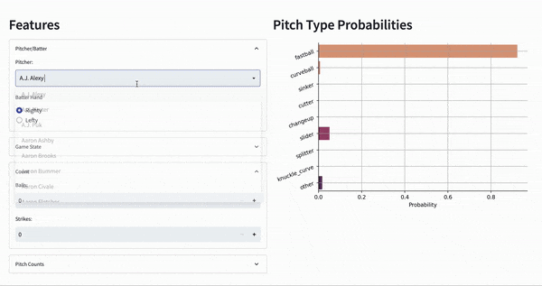

# PitchCast



## About

This project builds a neural network to predict the type of pitch (fastball, curveball, changeup, etc.) that will be thrown next in an MLB game. The predictions are based off the following features:
- Game state features, most importantly the score, the inning, the number of outs, whether there are runners on base, and the count.
- The distribution of pitches thrown by the pitcher at hand, e.g. 70% fastballs, 20% sliders, and 10% changeups.
- The number of pitches thrown in the at-bat, the inning, and the game.


## Motivation

This project was primarily created 1) to demonstrate the type of machine learning tasks I'm interested in and 2) to demonstrate my coding and model-building ability. 

It could also (at least theoretically) be used by a team to project the next type of pitch or by a bettor to place bets on the next pitch type. 

Since the primary purpose of the project was to showcase my interests and skills, I made some decisions to prioritize simplicity over precision. For instance, I did not attempt to include features related to a batter's performance against different pitch types since doing so made the code significantly messier. 


## Reviewing the Model-Building Code

The structure of the repository related to the model building is shown below. (The rest of the repo is to develop the Streamlit app described in the next section.) 

```
pitchcast
├── environment.yml
├── pipeline
│   ├── main.py
│   ├── pull_from_api.py
│   ├── convert_to_dataframe.py
│   ├── feature_engineering.py
│   ├── add_pitch_rates.py
│   └── pitcher_level_info.py
├── model
│   ├── fit.py
│   ├── hypermodel.py
│   ├── config.json
├── eda.ipynb
├── model.ipynb
```

The files in the `pipeline` directory pull the data from the [MLB Stats API](https://github.com/toddrob99/MLB-StatsAPI) and transform it into a model-ready DataFrame. 

The files in the `model` directory tune and fit the Keras neural network. I use the [KerasTuner](https://keras.io/keras_tuner/) package to determine the model's hyperparameters. 

The modeling process can also be followed more easily through the notebook `model.ipynb`. Additionally, the notebook `eda.ipynb` shows exploratory data analysis done to determine modeling features, etc.

## Demoing PitchCast

The PitchCast model can be demoed with the interactive app [here](https://pitchcast.herokuapp.com/). In this app, users can select a set of input features and observe the fitted probabilities for each pitch type. An example is shown at the top of the README.

Note that this app uses a simplified version of the model in order to reduce the number of features a user must input before seeing projections. For instance, this model does not include the number of pitches of each type thrown so far in the at-bat (which would be a pain for users to have to put in).

